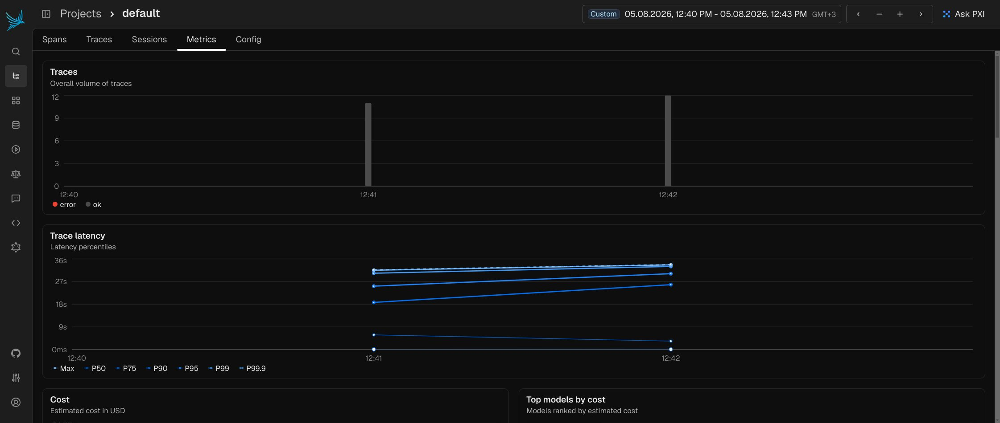
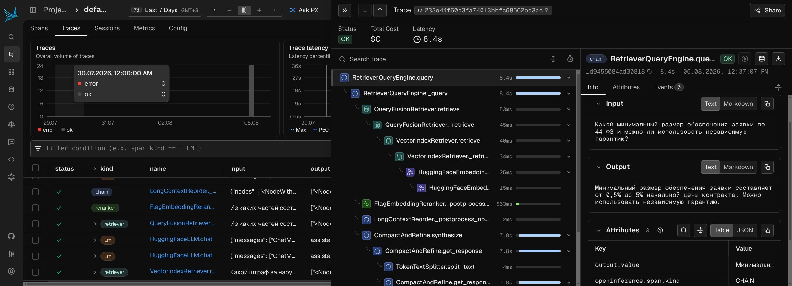

# Нейро-сотрудник: Тендерный консультант по 44-ФЗ

[English](README.md) | 🌐 **Русский**

RAG-агент для консультирования поставщиков по вопросам госзакупок по 44-ФЗ. Отвечает на вопросы на основе базы знаний из 34 документов, ссылается на статьи закона, честно признаёт незнание. Работает в Google Colab на контурной русскоязычной модели saiga_mistral_7b.

## Установка

1. Откройте `neiro_sotrudnik_44fz_rag_agent.ipynb` в Google Colab (Файл → Загрузить блокнот или из GitHub).
2. Добавьте Hugging Face токен в секреты Colab (значок ключа на левой панели) и укажите имя секрета в ячейке с `userdata.get(...)`.
3. Выполните ячейки по порядку - зависимости устанавливаются автоматически в первой ячейке (`!pip install`).

## Возможности

| Техника | Назначение |
|---|---|
| saiga_mistral_7b (4-bit NF4 + LoRA) | Русскоязычная генерация ответов |
| Ансамбль Dense + BM25 с RRF | Гибридный поиск: семантика + ключевые слова |
| HyDE | Повышает recall для сложных запросов |
| Cross-encoder реранкер | Точный отбор релевантных чанков |
| LongContextReorder | Оптимальный порядок чанков в контексте |
| Knowledge Graph RAG | Ответы на вопросы про связи сущностей |
| Трассировка Phoenix | Прозрачность каждого шага пайплайна |
| Response Validation | Детерминированная борьба с галлюцинациями |
| LRU-кэш | Ускорение повторных запросов |
| Безопасность | Guardrail по теме, чёрный список, лимит длины запроса |
| Системный промпт | Цитирование, уточнение, дисклеймер |
| Knowledge Maps (DDD) | Маршрутизация к экспертам домена |

## Трассировка Phoenix

Каждый запрос прослеживается в UI Phoenix: эмбеддинг, ретривал, реранкинг, генерация. Это помогает находить узкие места и симптомы галлюцинаций.

Дашборд латентности проекта:



Трасса заземлённого ответа (обеспечение заявки, ссылки на ст. 44 и 96):



## Структура проекта

```
├── neiro_sotrudnik_44fz_rag_agent.ipynb   - основной ноутбук (все этапы пайплайна)
├── Knowledge_graph_44fz.html              - интерактивная визуализация графа знаний (pyvis)
├── img/
│   ├── phoenix_project_overview_latency_dashboard.jpg
│   └── phoenix_rag_trace_grounded_response.jpg
├── README.md
├── README.ru.md
└── LICENSE
```

`storage_44fz/` (векторный индекс) создаётся при запуске ноутбука и не попадает в репозиторий.

## Как это работает

- **Пайплайн запроса**: безопасность → LRU-кэш → гибридный ретривал (Dense + BM25, RRF) → реранкинг → генерация → валидация → пост-обработка.
- **Гибридный ретривал**: результаты векторного поиска и BM25 объединяются через Reciprocal Rank Fusion.
- **Реранкинг**: cross-encoder `BAAI/bge-reranker-base` уточняет порядок чанков, `LongContextReorder` ставит самые релевантные в начало и конец контекста.
- **Валидация**: детерминированная проверка, что все упомянутые в ответе статьи и числа есть в контексте; при несовпадении ответ заменяется на «Я не знаю».
- **Граф знаний**: из документов извлекаются триплеты (субъект-предикат-объект), граф визуализируется через Pyvis.
- **Трассировка**: Phoenix собирает span-дерево запроса (эмбеддинг, ретривал, реранкинг, генерация) через OpenInference.
- **Безопасность**: проверка темы запроса (topic guardrail), чёрный список запрещённых тем, лимит длины запроса 1000 символов.

## Дисклеймер

Ответы носят информационный характер и не являются юридической консультацией. Для окончательного решения обратитесь к квалифицированному юристу.

## Лицензия

[MIT](LICENSE)
